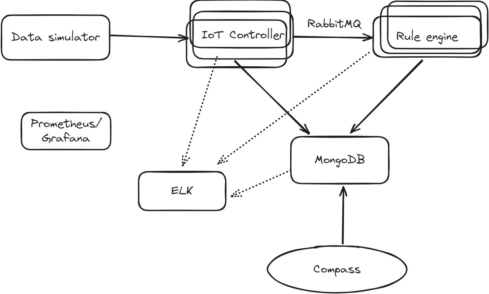
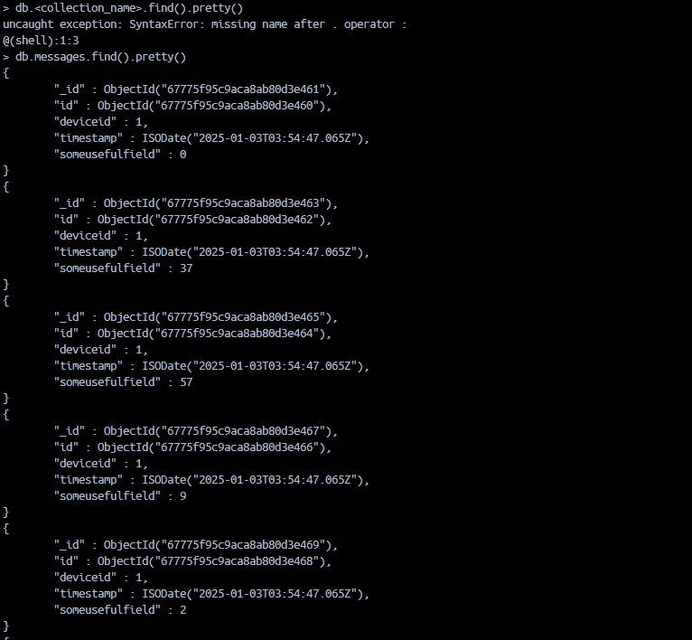
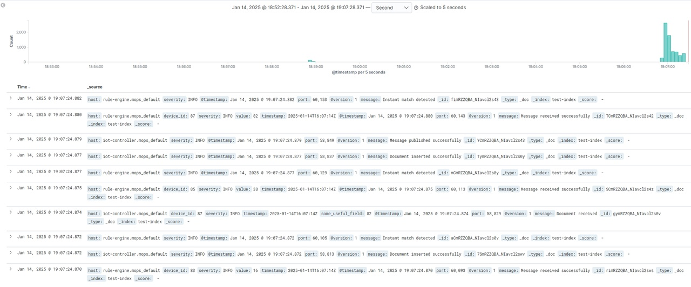
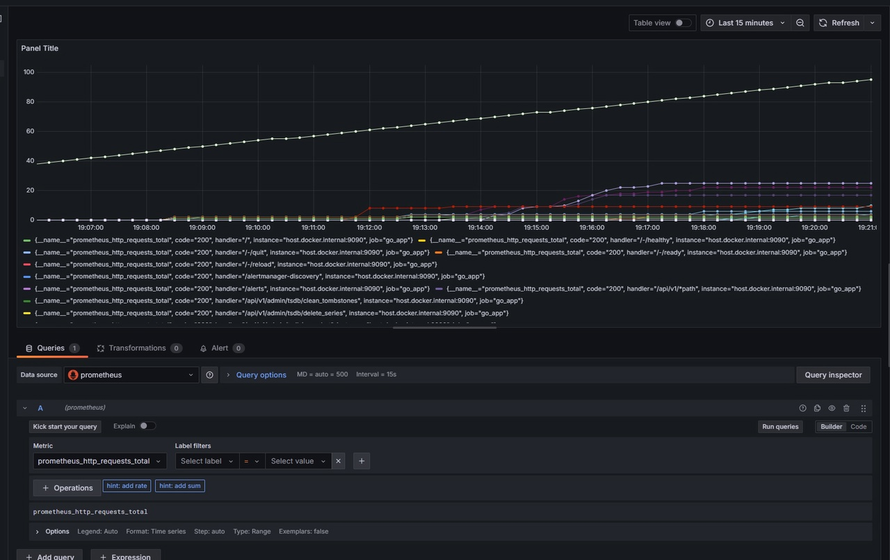
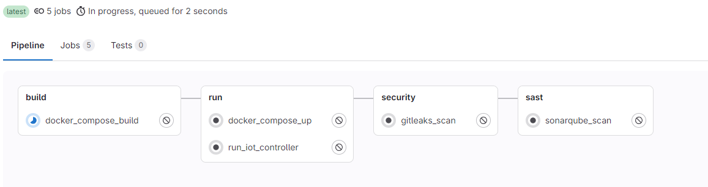

# Многоуровневая организация программных систем
## Отчёт по курсовой работе
**Тема:** Разработка простого IoT-сервиса.  
**Выполнил:** Нестеренко Н.В Могиленко Н.В. 
**Группа:** P4115  
**Преподаватель:** Перл И.А.  

### Архитектура системы
Требуется разработать IoT-сервис согласно данной архитектуре.
  
Сервис должен содержать части:
1. `Data Simulator` - сервис, эмулирующий поток данных, которые циркулируют по системе.
2. `IoT Controller` - сервис, выполняющий фильтрацию, валидацию входных данных и определяющий их дальнейшую траекторию передвижения.
3. `Rule Engine` - сервис, обрабатывающий данные от `IoT controller`. По заранее установленных правилам выполняет вставку записей в базу данных`MongoDB`.
4. `MongoDb` - хранилище данных.
5. `Compass` - визуализация данных, содержащихся в БД.
6. `Rabbitmq` - брокер сообщений для передачи данных из `IoT Controller` в `Rule Engine`.
7. `Prometheus` - компонент, используемый для сбора метрик разрабватываемого решения.
8. `Grafana` - визуализация данных, собранных `Prometheus`. 
9. `ELK stack`. Комплекс сервисов для сборки логов.

### Установленный формат данных
В качестве единицы данных используется `Protobuf`.
```proto
message GetPackageRequest {
  int32 deviceId = 1;
  google.protobuf.Timestamp timestamp = 2;
  int32 someUsefulField = 3;
}
```
Сообщение содержит информацию:
- `deviceId` отправителя (устройство, с которого пришли данные)
- `timestamp` - временная метка сообщения.
- `someUsefulField` - поле, генерируемое "устройствами".

### Бизнес-логика разрабатываемого решения
1. `Data Simulator` генерирунет данные.    Поддерживаются настройки:  
    -  Количество клиентов
    - Частота отправки [сообщений\секунду].
2. `IoT Controller`. Осуществляет валидацию пакетов по следующему алгоритму принятия решений: 
 - Если поле `alpha` входящего пакета  < 25, то `IoT Controller` не принимает пакет.
 3. `Rule Engine`. Выполняет data-processing и заполняет БД событиями `instant rule, ongoing rule`. Ведёт учёт последних `k=10` пакетов при помощи БД. 
  - Если поле `someUsefulField` > 5, то срабатывает `instant rule`.
  Отслеживается следующее: поле `someUsefulField` > 75 встречается более 5 раз на протяжении 10 пакетов.

### Организация взаимодействия модулей
1. Каждое решение (кроме генератора данных, запускаемого из скомпилированного файла) помещается в свой собственный контейнер.
2. Взаимодействие происходит при помощи `docker`-сети.
3. "Общение" data-simulator и iot-contoller осуществляется посредством двунаправленного стриминга.

### Программное обеспечение
Помимо ранее объявленного ПО, укажем следующее:
1. `docker, docker-compose` - контейнеризация разрабатываемых решений.
2. `Go` - основной язык программирования.
3. `Google Protobuf 3` - сериализация\десериализация сообщений. 

### Перечень собираемых приложением метрик 
1. `Controller`: количество принятых/не принятых пакетов.
2. `Rule Engine`: количество сработавших `instant, ongoing rules`. 
3. `Datasim`: количество подключенных устройств в момент времени `t`.
4. `Datasim`: количество успешно принятых запросов
5. `Datasim`: количество устройств.
6. `Datasim`: длительность обработки одного запроса.
5. `Rabbitmq`: количество сообщений, прошедших через брокер.

### Структура проекта

Главные папки и их назначение:

1. `iot-controller`:
Управляет устройствами и их данными.
Реализует gRPC API для взаимодействия.
Сохраняет данные в MongoDB.
Использует RabbitMQ для асинхронной обработки сообщений.
Мониторинг выполняется через Prometheus.
2. `rule-engine`:
Выполняет бизнес-логику на основе данных, полученных от iot-controller.
Интегрируется с RabbitMQ для получения сообщений.
Логирует события с использованием Logstash.
3. `logstash`:
Обеспечивает обработку и централизованное логирование данных из микросервисов.
Структура каждой папки:

4. `cmd`:
Точка входа приложения (main.go), где задаются основные настройки и подключение к сервисам.
internal:
entities: Описывает модели данных для работы с MongoDB и внутренние структуры данных.
server: Реализует серверы (например, gRPC-сервер в iot-controller).
service: Включает бизнес-логику, например обработку данных и взаимодействие с RabbitMQ.
infra: Утилиты для интеграции с внешними системами (RabbitMQ, Prometheus).
repository: Функции для работы с базой данных MongoDB.
core (только в rule-engine): Логика обработки сообщений и проверка бизнес-правил.
5. `Конфигурационные файлы` :
.env: Переменные окружения (адреса сервисов, порты, учетные данные).
Dockerfile: Содержит инструкции для контейнеризации сервисов.

### Взаимодействие компонентов
1. `iot-controller` отправляет данные устройств в MongoDB и RabbitMQ.
2. `rule-engine` обрабатывает сообщения из RabbitMQ, проводит валидацию и логирует результаты через Logstash.
3. `Prometheus и Logstash` работают независимо, обеспечивая мониторинг и логирование всей системы.

### Скриншоты работы

  

Каждый объект в коллекции представляет документ, содержащий следующие поля:
`_id`: Уникальный идентификатор объекта, автоматически генерируемый MongoDB (тип ObjectId).
`id`: Поле с другим идентификатором.
`deviceId`: Идентификатор устройства, от которого поступили данные (значение в примере: 1).
`timestamp`: Временная метка (ISODate), указывающая дату и время, связанные с записью.
`someUsefulField`: Пользовательское поле, содержащее числовые значения (в примере: 0, 37, 57, и т.д.).



1.  График (верхняя часть):

Отображает распределение событий (логов) по времени.
График группирует события по интервалам (например, каждые 5 секунд) и показывает их количество.

2. Список событий (нижняя часть):

Каждая строка представляет отдельный лог-сообщение.
Логи отсортированы по времени (колонка Time), начиная с наиболее недавних событий.

Каждое сообщение содержит следующие ключевые поля:

`host`: Указывает хост, откуда пришел лог (например, rule-engine.mops_default, iot-controller.mops_default).
`severity`: Уровень важности лога (INFO в данном случае).
`message`: Основное содержание сообщения.



1. График (основная часть):

Отображает данные о количестве HTTP-запросов (prometheus_http_requests_total), сгруппированных по различным обработчикам (handlers).
Линии представляют разные метрики, такие как запросы к маршрутам /, /ready, /reload, /alerts и другим.
Ось Y показывает общее количество запросов, а ось X — временную шкалу.

2. Легенда (под графиком):

Указаны метрики, которые разделены по следующим критериям:
handler: Роут или конечная точка, на которую поступили запросы (например, /, /ready, /alerts).
instance: Хост приложения (в данном случае host.docker.internal:9090).
job: Название задачи или сервиса, отправляющего метрики (например, go_app).
code: HTTP-статус-код (все метрики имеют код 200, что указывает на успешные запросы).
Консоль запросов (нижняя часть):

Выполняется запрос к Prometheus для метрики prometheus_http_requests_total.
Настроен фильтр метрик (без дополнительных значений).


### Оценка проекта по принципам

`1. Автоматическое восстановление (Design for Self-Healing)`:
Обработчики ошибок:
Код включает обработку ошибок через специализированные исключения (exceptions.HandleError), что позволяет избежать неожиданных сбоев.
В main.go для iot-controller и rule-engine есть логирование ошибок при работе с внешними сервисами (RabbitMQ, MongoDB).
Ретраи и изоляция ресурсов:
Есть явная реализации механизмов ретрая при сбоях (например, повторное подключение к RabbitMQ или MongoDB). Используется мониторинг с Prometheus, что дает возможность отслеживать состояние системы.

`2. Избыточность (Make All Things Redundant)`:
Подключения:
RabbitMQ и MongoDB используются без явного резервирования или переключения.
Логирование:
Логирование идет через Logstash, но не указаны резервные пути в случае недоступности Logstash.
Рекомендации:
Добавить резервные подключения для RabbitMQ и MongoDB.
Реализовать автоматическое переключение (failover).

`3. Минимизация координации (Minimize Coordination)`:
Асинхронная обработка:
RabbitMQ используется для асинхронной обработки сообщений, что соответствует минимизации координации.
Оптимистичные блокировки:
Не используется, но может быть полезно при работе с MongoDB для снижения блокировок.
Рекомендации:
Рассмотреть внедрение событийной архитектуры (event sourcing).
Добавить использование оптимистичных блокировок в MongoDB.

`4. Масштабирование (Design for Scale-Out)`:
Горизонтальное масштабирование:
RabbitMQ и MongoDB могут масштабироваться горизонтально, но код не предоставляет явных механизмов для поддержки этого.
Слабосвязанные компоненты:
Компоненты разнесены по микросервисам (iot-controller, rule-engine), что способствует масштабируемости.
Рекомендации:
Убедиться, что микросервисы можно масштабировать независимо друг от друга.
Проверить использование соединений с RabbitMQ/MongoDB на предмет ограничений при масштабировании.

`5. Разделение (Partitioning)`:
Разделение данных:
MongoDB используется для хранения данных, но в коде нет явной поддержки разделения коллекций или баз данных по шардам.
Очереди:
RabbitMQ поддерживает разделение очередей, но это не отражено в коде.
Рекомендации:
Реализовать поддержку шардирования в MongoDB.
Включить разделение очередей RabbitMQ для разных типов сообщений.

`6. Операционная совместимость (Design for Operations)`:
Мониторинг:
Prometheus интегрирован для мониторинга запросов и длительности выполнения.
Логирование:
Логирование осуществляется через Logstash.


`7. Эволюция системы (Design for Evolution)`:
Слабосвязанные компоненты:
Код разделен на микросервисы, что соответствует принципу слабосвязанности.
Использование интерфейсов:
Внедрена модульная структура с выделением сервисов, репозиториев и инфраструктуры.

### БОНУСНАЯ ЧАСТЬ

Дополнительно настроили пайплайн CI/CD



**Этапы пайплайна:

`build`:

Этот этап отвечает за сборку всех необходимых Docker-образов с помощью Docker Compose.
Используется команда docker-compose build, которая создает контейнеры на основе конфигурации docker-compose.yml.

`run`:

Этот этап включает два шага:
Запуск всех сервисов из docker-compose.yml (например, базы данных, брокеров сообщений и приложений).


`security`:

Этот этап предназначен для проверки безопасности кода и репозитория.
Выполняется сканирование с использованием Gitleaks для выявления утечек секретов, таких как API-ключи, пароли и токены.

`sast`:

Этот этап выполняет статический анализ кода на уязвимости с использованием SonarQube.
Сканирование проверяет код на наличие багов, потенциальных уязвимостей и проблем с качеством